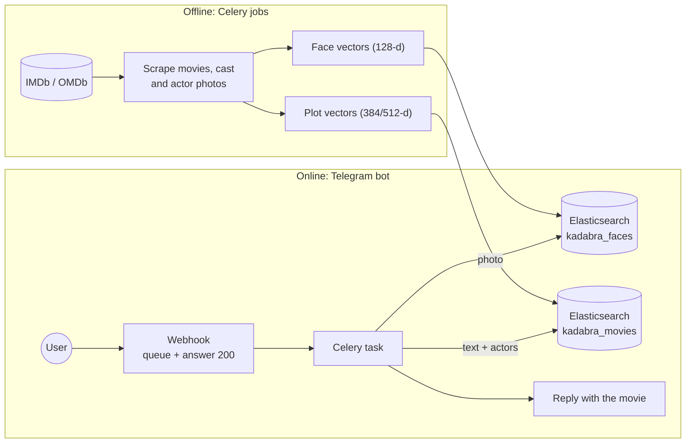

# Kadabra! 🎬

### Shazam for movies

Send a **photo of the screen** or **describe the plot**, and the Telegram bot **FilmSleuth** tells you which movie it is.

This project builds on and improves [**Kadabra_public**](https://github.com/ijzepeda/Kadabra_public), a collaborative project I contributed to. It continues that Django backend with the Telegram bot, vector search in Elasticsearch, a way to measure search quality, and many performance, reliability and security fixes.

---

## Contents

- [What it does](#what-it-does)
- [How it works](#how-it-works)
- [Features](#features)
- [Tech stack](#tech-stack)
- [Getting started](#getting-started)
- [Upgrading an existing installation](#upgrading-an-existing-installation)
- [Measuring search quality](#measuring-search-quality)
- [Management commands](#management-commands)
- [Configuration](#configuration)
- [Tests](#tests)
- [Project layout](#project-layout)
- [Documentation](#documentation)
- [Credits and license](#credits-and-license)

---

## What it does

| You send FilmSleuth… | It… |
|---|---|
| a **photo** where actors are visible | recognises the actors' faces and lists the movies they appear in together |
| a **text** such as *"astronaut stranded on Mars grows potatoes"* | finds the movies whose plot means the same thing, even when they share no words with your text |
| a **photo with a caption** | uses both: the movies of the recognised actors, ranked by how well their plot matches the caption |
| a **photo without faces** *(optional)* | compares it with movie posters (CLIP) |

Bot commands: `/start` (welcome message), `/list` (indexed movies), `/cancel`.

---

## How it works



1. **Offline:** Celery jobs scrape the movies and actor photos and turn each face and each plot into a **vector**, a list of numbers that captures what the face or the text looks like. The vectors are stored once in Elasticsearch.
2. **Online:** the bot turns your photo or text into a vector the same way, and Elasticsearch finds the **nearest stored vectors**. It uses an HNSW graph, so it doesn't compare against every vector.
3. **Faces narrow the plot search:** the actors recognised in the photo become a filter, so only their movies are ranked by the text.

The full explanation (scores, thresholds, why vectors are fast, every search mode) is in **[docs/ARCHITECTURE.md](docs/ARCHITECTURE.md)**.

---

## Features

**Search**
- **Face recognition:** kNN over face vectors, where the 10 nearest stored faces vote for an actor (weighted by score).
- **Plot search:** kNN over text embeddings, filtered by the recognised actors, with a fallback to text only.
- **Three text modes**, switchable from the Django admin:
  - `vector`: one vector per movie;
  - `hybrid`: vector candidates reordered with keyword (BM25) ranking;
  - `passages`: several vectors per synopsis.
- **Pluggable text model:** Universal Sentence Encoder (default), MiniLM, or multilingual MiniLM, which also understands Spanish.
- **Optional scene search** for photos without faces, using CLIP vectors of movie posters.
- **Optional compression:** byte (int8) vectors, 4× smaller.

**Quality and operations**
- **Evaluation tooling:** hit@1, hit@3 and MRR on your own labelled cases, suggested score thresholds, and a face test that needs no labelling.
- **Zero-downtime index rebuilds:** versioned indices behind aliases.
- **Bot work in Celery:** the webhook answers Telegram immediately, and repeated updates are ignored.
- **Safe job queue:** `SELECT … FOR UPDATE SKIP LOCKED`, so parallel workers never process the same row.
- **Security:** optional Telegram webhook secret, and staff-only webhook management.
- 60 tests, including integration tests against a real Elasticsearch.

---

## Tech stack

| Area | Tools |
|---|---|
| Backend | Django 4.2, Django REST Framework (`adrf`), django-constance (settings editable in the admin) |
| Jobs | Celery 5 + Redis, django-celery-beat |
| Storage | PostgreSQL, Elasticsearch 8.8 (`dense_vector` + kNN) |
| Faces | `face_recognition` (dlib), DeepFace (age), OpenCV |
| Text | TensorFlow Hub Universal Sentence Encoder, sentence-transformers, NLTK |
| Images | CLIP (`clip-ViT-B-32` via sentence-transformers) |
| Bot | python-telegram-bot 20 (webhook) |

---

## Getting started

**Requirements:** Python 3.11 (the version the tests were run with; TensorFlow 2.13 does not support newer versions), Docker (for PostgreSQL, Redis and Elasticsearch), and a Telegram bot token from [@BotFather](https://t.me/BotFather).

```bash
# 1. Services: PostgreSQL, Redis, Elasticsearch 8.8
docker compose up -d

# 2. Configuration
cp .env.example .env                  # edit SECRET_KEY, BOT_TOKEN, BOT_URL, IMDBID_APIKEY…
export SECRETS_PATH_FILE=$PWD/.env

# 3. Python dependencies
python -m venv .venv && source .venv/bin/activate
pip install -r requirements.txt

# 4. Database and admin user
cd django_project
python manage.py migrate
python manage.py createsuperuser

# 5. Run (one terminal each)
python manage.py runserver
celery -A ms_data_mining worker -l info    # scraping/indexing jobs and the bot replies
celery -A ms_data_mining beat -l info      # schedules the jobs
```

**Connect the bot:** `BOT_URL` must be a public HTTPS address of `/bot/webhook/`. For local development, a tunnel such as ngrok works. Log in to `/admin/` as a staff user, then open `/bot/webhook/subscribe`.

> The webhook only queues each message. If no Celery **worker** is running, the bot never replies.

---

## Upgrading an existing installation

This version stores search data in new indices (`kadabra_*`). Your old indices (`celebrity`, `movies_search`) are not changed. Copy them once; the stored vectors are reused, so nothing is scraped or re-encoded:

```bash
python manage.py migrate
python manage.py rebuild_indices faces  --source celebrity
python manage.py rebuild_indices movies --source movies_search
```

- Pause the Elasticsearch Celery tasks while this runs. Documents written to the old indices during a rebuild aren't copied.
- Until both commands have run, the new indices are empty and the bot finds nothing.
- After upgrading, check the thresholds in **Admin → Constance**. A value that was saved there earlier overrides the new defaults.

---

## Measuring search quality

Thresholds and models should be chosen with numbers, not guesses:

```bash
python manage.py build_eval_cases ../eval/cases.jsonl --count 80   # skeleton: fill in text and/or image
python manage.py evaluate_search --cases ../eval/cases.jsonl        # hit@1, hit@3, MRR, suggested THRESHOLD_TEXT
python manage.py evaluate_search --faces 300                        # face accuracy, suggested THRESHOLD_IMAGE
```

Include some negative cases (movies that are *not* indexed, with `"expected_imdb_id": null`), so the suggested threshold also learns what to reject. See **[eval/README.md](eval/README.md)**.

---

## Management commands

| Command | What it does |
|---|---|
| `rebuild_indices faces\|movies\|passages\|posters [--source INDEX] [--reembed] [--keep-old]` | Builds a new index version, copies or re-encodes the documents, and switches the alias with no downtime |
| `build_eval_cases FILE [--count N]` | Writes evaluation cases from random indexed movies, for you to fill in |
| `evaluate_search --cases FILE [--mode vector\|hybrid\|passages] [--no-preprocess] [--output report.json]` | Measures text/photo search quality and suggests thresholds |
| `evaluate_search --faces N` | Leave-one-out face recognition test (no labels needed) |

---

## Configuration

Every environment variable is listed with comments in **[`.env.example`](.env.example)**. The most important ones:

| Variable | Description |
|---|---|
| `DATABASE_URL`, `CELERY_BROKER_URL`, `REDIS_*` | PostgreSQL and Redis connections (the defaults match `docker-compose.yml`) |
| `ELASTICSEARCH_HOST` (+ `_USER`, `_PWD`) | Elasticsearch connection |
| `BOT_TOKEN`, `BOT_URL` | Telegram bot token and the public URL of `/bot/webhook/` |
| `BOT_SECRET_TOKEN` | *(recommended)* Telegram sends it back on every webhook call; requests without it are rejected |
| `IMDBID_APIKEY` | OMDb API key (movie data and posters) |
| `TEXT_EMBEDDING_MODEL` | `use-large` (default), `minilm` or `minilm-multilingual`. Changing it requires `rebuild_indices movies --reembed`. |
| `INDEX_MOVIE_PASSAGES` / `INDEX_MOVIE_POSTERS` | Also index synopsis passages / poster vectors |
| `ELASTICSEARCH_VECTOR_ELEMENT_TYPE` | `float` (default) or `byte` (int8 vectors, 4× smaller) |
| `PRELOAD_NLP_MODEL` | Load the text model at startup instead of on the first request |

Search settings that change at runtime are edited in **Admin → Constance**:
- `THRESHOLD_IMAGE`, `THRESHOLD_TEXT`, `THRESHOLD_SCENE`
- `FACE_KNN_K`, `FACE_MIN_VOTES`
- `TEXT_SEARCH_MODE`, `TEXT_PREPROCESS`
- `SCENE_SEARCH_ENABLED`

---

## Tests

```bash
docker compose up -d db elasticsearch
cd django_project
ELASTICSEARCH_TEST_HOST=http://localhost:9200 python manage.py test --settings=ms_data_mining.settings_test
```

- **PostgreSQL:** the tests run against PostgreSQL (`TEST_DATABASE_URL`, which defaults to the docker-compose database). The job queue relies on `SKIP LOCKED`, which SQLite doesn't support.
- **Elasticsearch:** without `ELASTICSEARCH_TEST_HOST`, the 5 integration tests are skipped.
- **ML libraries:** TensorFlow, dlib, OpenCV and DeepFace are imported lazily, so the tests don't need them.

---

## Project layout

```
django_project/
├── apps/
│   ├── botAI/        # Telegram bot logic, SearchImage / SearchScene / SearchText
│   ├── celebrity/    # Actors, actor images, face indexing jobs, webhook views, Celery tasks
│   ├── movies/       # Movies, movie-actor relations, movie/passage/poster indexing jobs
│   └── document/     # Elasticsearch indices, encoders, ranking helpers, management commands
└── ms_data_mining/   # Django settings, Celery app + beat schedule, job base class
eval/                 # Search evaluation cases
docs/                 # Architecture notes
docker/               # PostgreSQL init script
docker-compose.yml    # PostgreSQL, Redis, Elasticsearch for local development
```

---

## Documentation

- **[docs/ARCHITECTURE.md](docs/ARCHITECTURE.md):** how the vector search works, score formulas, every search mode, how to operate and upgrade the indices.
- **[eval/README.md](eval/README.md):** how to build the evaluation set and read the results.

---

## Credits and license

Based on [**Kadabra_public**](https://github.com/ijzepeda/Kadabra_public), a collaborative project. 
Thanks to everyone who contributed to it.

Released under the [MIT License](LICENSE).
