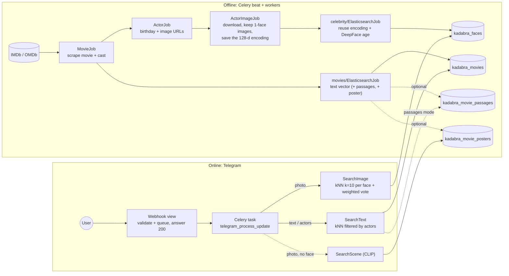

# How Kadabra finds a movie: the Elasticsearch vector-search architecture

This page explains how the project stores vectors in Elasticsearch (ES), why that makes matching fast, and how each part of the search works. It also lists what was verified, and what you still need to measure with your own data.

> **Versions:** everything below was tested against **Elasticsearch 8.8.0** (the version of the Python client in `requirements.txt`). The optional `int8_hnsw` index type does **not** exist in 8.8. See *Compression*.

---

## 1. The idea in one picture

The work is split into two phases:

1. **Offline (Celery jobs):** turn every face image and every movie description into a vector, a list of numbers, and store it in ES. This happens once per item.
2. **Online (bot request):** turn the user's photo or text into a vector the same way, then ask ES for the nearest stored vectors.



Postgres holds the work queues: `Movie`, `Actor`, `ActorImage`, `ElasticSearchActorImage` and `ElasticSearchMovie`, each with a `status` and an `attempt` count. ES holds only the searchable vectors and the few fields needed to build the reply.

### The indices

Every index is reached through an **alias** that points to one timestamped concrete index (`kadabra_faces` → `kadabra_faces_20261004…`). Changing a mapping or a model means building a new index and switching the alias atomically (`manage.py rebuild_indices`), so there is no downtime.

| Alias | One document per | Vector | Model | Similarity |
|---|---|---|---|---|
| `kadabra_faces` | actor image (one face) | 128-d | `face_recognition` (dlib) | `l2_norm` |
| `kadabra_movies` | movie | 512-d (USE) or 384-d (MiniLM) | `TEXT_EMBEDDING_MODEL` | `cosine` |
| `kadabra_movie_passages` *(optional)* | ~120-word passage of a synopsis | same as movies | same as movies | `cosine` |
| `kadabra_movie_posters` *(optional)* | movie poster | 512-d | CLIP ViT-B/32 | `cosine` |

All vector fields use `index: true`, so ES builds an HNSW graph (see 2.2). Movies also store a flat `actor_ids` keyword array, used as a cheap kNN filter.

---

## 2. Why storing vectors makes matching fast

### 2.1 Comparing numbers instead of pictures or words
A face photo has hundreds of thousands of pixels, but the dlib model reduces it to **128 numbers**. Two photos of the same person produce vectors that sit close together. A synopsis becomes 384–512 numbers, and descriptions with similar meaning sit close together even when they share no words.

The expensive step, running the neural network, happens **once per stored item, offline**. At query time the bot runs a model only on the user's one photo or sentence.

### 2.2 Brute force vs. an index (HNSW)
- **Brute force (exact):** compare the query with *every* stored vector. The cost grows linearly with the data. For example, 100,000 face images × 128 dimensions is 12.8 million multiply-adds per face per query. **The previous face search worked this way:** a `script_score` with `cosineSimilarity` over `match_all`, on a field that wasn't indexed.
- **Approximate nearest neighbour (ANN) with HNSW:** with `index: true`, ES (through Lucene) inserts each vector into a layered "small-world" graph where each vector links to a few close neighbours. A search walks greedily from the top layer down and visits only a small fraction of the vectors. `num_candidates` controls how many candidates are explored: more candidates give better recall but a slower search. The trade-off is approximate results, more memory, and slower indexing.

The cost of organising the vectors (building the graph) is paid once when a document is written, and each query reuses it.

### 2.3 How similarity becomes an ES score (verified on 8.8)

| `similarity` | score | used for |
|---|---|---|
| `l2_norm` | `1 / (1 + distance²)` | faces |
| `cosine` | `(1 + cos) / 2` | text, posters |

`face_recognition` treats two faces as the same person when their Euclidean **distance is below 0.6**. That is a score of `1 / (1 + 0.36) ≈ 0.735`, the default `THRESHOLD_IMAGE`. A text score of 0.60 means cosine ≥ 0.2.

---

## 3. How each search works now

### 3.1 Faces: kNN + weighted vote (`SearchImage`)
1. `face_recognition` encodes every face in the photo.
2. **A single `_msearch` call** sends one kNN search per face: `k = FACE_KNN_K` (10) and `num_candidates = FACE_NUM_CANDIDATES` (100).
3. For each face, the hits above `THRESHOLD_IMAGE` **vote** for their `actor_id`, weighted by score. The actor with the highest summed score wins, and ties go to the most votes. An actor needs at least `FACE_MIN_VOTES` hits.

Why weighted? A plain vote count lets several *distant* faces outvote one near-identical face. The leave-one-out test on a real ES instance showed exactly that before the fix.

### 3.2 Text: kNN with an actor **filter** (`SearchText`)
| Input | Query |
|---|---|
| text only | kNN on `description_vector` |
| text + recognised actors | kNN **with `filter: terms actor_ids`**: only movies with those actors are ranked. If nothing passes the threshold, it falls back to text only (in case the face match was wrong). |
| actors only (photo) | `bool` filter on `actor_ids`. Score = number of recognised actors in the cast (+0.5 when the year looks right). |

The `THRESHOLD_TEXT` cutoff applies **only to vector scores**. The previous code added the vector score and a text-relevance score together before applying the cutoff.

`TEXT_SEARCH_MODE` (Constance) chooses the text strategy:
- **`vector`** (default): one vector per movie.
- **`hybrid`:** take 5×k vector candidates above the threshold, rank the same candidates with BM25 keywords, and fuse both rankings with **Reciprocal Rank Fusion** (`1/(60+rank)`). This is done in Python, so it works on ES 8.8 with any licence. It helps when the user types exact words such as a character name.
- **`passages`:** search `kadabra_movie_passages` (overlapping ~120-word windows of each synopsis) and keep the best passage per movie. A short description can then match the part of a long plot it describes.

### 3.3 Scene search (`SearchScene`, optional)
When a photo has no recognisable face and no caption, it is encoded with **CLIP** and matched against the CLIP vectors of the movie posters. Enable it with `INDEX_MOVIE_POSTERS=True` (indexing) and the Constance flag `SCENE_SEARCH_ENABLED`.

Posters are a weak stand-in for real movie stills. Measure this mode with `evaluate_search` before you rely on it.

### 3.4 The bot runs in Celery
The webhook view does three things:
- checks the optional `BOT_SECRET_TOKEN`;
- drops updates Telegram has already sent (Redis `SET NX` on `update_id`, kept 24 h);
- queues `telegram_process_update`, then answers **200 immediately**.

The worker does the face and text work and replies through the Bot API. If the broker is down, the view answers 503 and forgets the `update_id`, so Telegram's retry is processed.

### 3.5 Compression
- `ELASTICSEARCH_VECTOR_ELEMENT_TYPE=byte` stores text and poster vectors as **int8**, 1 byte per dimension instead of 4 (verified on 8.8).
  - Vectors are normalised and scaled to [-127, 127], and query vectors are quantised the same way.
  - On the small test set the ranking and the suggested threshold barely changed (0.6349 → 0.6358).
  - Faces stay float, because `l2_norm` depends on the vector length.
- `ELASTICSEARCH_VECTOR_INDEX_TYPE` passes an HNSW variant such as `int8_hnsw` for ES versions that support it. **8.8 rejects it.**

---

## 4. Measuring quality (`eval/`)
- `manage.py build_eval_cases` writes a skeleton of 50–100 indexed movies for you to fill in with your own synopses and screenshots. Add negative cases (`expected_imdb_id: null`) for movies that are not in the collection.
- `manage.py evaluate_search --cases …` reports:
  - `hit@1`, `hit@3` and MRR per query type;
  - a **suggested threshold** (the cutoff with the best F1 between correct and wrong top answers);
  - how many negative cases the current and suggested thresholds reject.
- `manage.py evaluate_search --faces N` needs no labels. It searches with each indexed face while excluding that face itself (leave-one-out), and reports accuracy and a suggested `THRESHOLD_IMAGE`.

See `eval/README.md`.

---

## 5. Operating it

### First deployment of this version
Old indices (`celebrity`, `movies_search`) are not changed. Copy them once into the new aliases. Pause the Elasticsearch Celery tasks while you do this, because documents written to the old index during a rebuild are not copied.

```bash
python manage.py migrate                                     # adds ActorImage.face_encoding
python manage.py rebuild_indices faces  --source celebrity     # same vectors, now with an HNSW index
python manage.py rebuild_indices movies --source movies_search # adds actor_ids, cosine similarity
python manage.py evaluate_search --faces 300                   # check THRESHOLD_IMAGE on your data
```

Until those two commands run, the new aliases are empty and the bot finds nothing. A warning is logged when that's the case.

### Changing the text model or the compression
Set `TEXT_EMBEDDING_MODEL` (`use-large`, `minilm` or `minilm-multilingual`) and/or `ELASTICSEARCH_VECTOR_ELEMENT_TYPE`, then run:

```bash
python manage.py rebuild_indices movies --reembed
python manage.py rebuild_indices passages          # if INDEX_MOVIE_PASSAGES=True
```

The app refuses to use an index built with a different model, because mixing vectors from two models gives meaningless scores.

### Optional indices
```bash
INDEX_MOVIE_PASSAGES=True  python manage.py rebuild_indices passages
INDEX_MOVIE_POSTERS=True   python manage.py rebuild_indices posters   # downloads posters (OMDb)
```

---

## 6. What still needs your data
- **Thresholds:**
  - `THRESHOLD_TEXT = 0.60` and `THRESHOLD_SCENE = 0.62` are **provisional**. Set them from `evaluate_search` on your own cases.
  - `THRESHOLD_IMAGE = 0.735` comes from `face_recognition`'s documented tolerance. Confirm it with `--faces`.
- **Constance values already in Redis:** if a key was ever saved in the admin, the stored value wins over the new defaults. Check *Constance → Search options* and *Actor options* after you deploy.
- **The photo year:** it is still the year of the *matched stored image* (birthday + estimated age), not of the user's photo. Running the age model on the query face would fix this. It was not part of this change.
- **Model comparisons:** run `evaluate_search` once per setting. Compare `vector`, `hybrid` and `passages`, with and without `--no-preprocess`, and USE vs MiniLM. The NLTK preprocessing (lemmas, no stop words) was designed for the original pipeline and may hurt sentence-embedding models.
