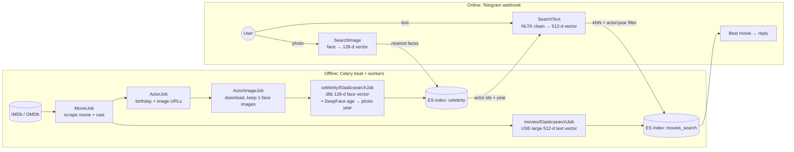

# How Kadabra finds a movie: the Elasticsearch vector-search architecture

This page explains how the project stores vectors in Elasticsearch (ES), why that makes matching fast, what the current code actually does, and what to improve next.

> **Version caveat:** some Elasticsearch details below depend on the server version. The Python client here is `elasticsearch==8.8.0`, but I don't know which ES server version you run. Items marked *(verify)* should be checked against the docs for your version.

---

## 1. The idea in one picture

The work is split into two phases:

1. **Offline (Celery jobs):** turn every face image and every movie description into a vector, a list of numbers, and store it in ES. This happens once per item.
2. **Online (bot request):** turn the user's photo or text into a vector the same way, then ask ES for the nearest stored vectors.



Postgres holds the work queues: `Movie`, `Actor`, `ActorImage`, `ElasticSearchActorImage` and `ElasticSearchMovie`, each with a `status` and an `attempt` count. ES holds only the searchable vectors and the few fields needed to build the reply.

### The two indices today

| Index | Vector field | Model | Dims | ES mapping |
|---|---|---|---|---|
| `celebrity` | `face_encoding` | `face_recognition` (dlib ResNet) | 128 | `dense_vector`, **no `index`, no `similarity`** |
| `movies_search` | `description_vector` | Universal Sentence Encoder large v5 | 512 | `dense_vector`, `index: true`, `similarity: l2_norm` |

Other fields:
- **`celebrity`:** `actor_id`, `name`, `age`, `birthday`, `year`. Here `year` is birthday + estimated age, so it approximates the year that photo was taken.
- **`movies_search`:** `title`, `year`, `imdb_id`, and a nested `celebrities {id, name}`.

---

## 2. Why storing vectors makes matching fast

### 2.1 Comparing numbers instead of pictures or words
A face photo has hundreds of thousands of pixels, but the dlib model reduces it to **128 numbers**. Two photos of the same person produce vectors that sit close together. A synopsis becomes **512 numbers**, and descriptions with similar meaning sit close together even when they share no words.

The expensive step, running the neural network, happens **once per stored item, offline**. At query time the bot runs the model only on the user's one photo or sentence. Matching is then pure arithmetic between vectors.

### 2.2 Brute force vs. an index (HNSW)
There are two ways to find the nearest vectors:

- **Brute force (exact):** compare the query with *every* stored vector. The cost grows linearly with the data. For example, 100,000 face images × 128 dimensions is 12.8 million multiply-adds per face per query, and the cost keeps growing as you scrape more actors.
- **Approximate nearest neighbour (ANN) with HNSW:** when a vector is stored with `index: true`, ES (through Lucene) inserts it into an **HNSW graph**. This is a layered "small-world" network where each vector links to a few close neighbours. A search starts at the top layer, greedily walks towards the query, and drops down layer by layer. It visits only a small fraction of the vectors, so query cost grows roughly logarithmically instead of linearly. The trade-off: results are *approximate*, it uses more memory, and indexing is slower. `num_candidates` controls how many candidates are explored. More candidates give better recall but a slower search.

This is the real speed win from *saving* vectors in ES. The work of organising the vectors, building the graph, is paid once when a document is written, and each query reuses it.

### 2.3 How similarity becomes an ES score
For `knn` search, ES turns distance into a score where higher means more similar *(verify for your version)*:

| `similarity` | score |
|---|---|
| `l2_norm` | `1 / (1 + distance²)` |
| `cosine` | `(1 + cos) / 2` |
| `dot_product` (unit vectors) | `(1 + dot) / 2` |

This matters for thresholds; see 3.3.

---

## 3. What the current code actually does, and its weak points

### 3.1 Face search is brute force (the biggest performance issue)
`Faces.__create_index` maps `face_encoding` as `{"type": "dense_vector", "dims": 128}` with no `index` or `similarity`, and `Faces.query_face` uses a `function_score` + `script_score` running `cosineSimilarity(...)` over a `match_all`.

That **scans every face document on every query**, so the HNSW graph described in 2.2 is never used for faces. Search time grows with every image the scrapers add. In ES 8.8, `dense_vector` defaults to *not indexed*. I believe newer 8.x versions changed that default, but the script query would still be brute force *(verify)*.

### 3.2 The face model and the similarity measure don't match
dlib/`face_recognition` vectors are meant to be compared with **Euclidean distance**. The library's default "same person" tolerance is `0.6`. The code uses cosine similarity with `THRESHOLD_IMAGE = 0.93`, a value that wasn't derived from the model.

Also, the script score isn't shifted to be non-negative. Cosine can be below 0, and ES rejects negative scores in some scoring contexts *(verify)*.

### 3.3 The text threshold barely filters anything
`movies_search` uses `l2_norm`, so `score = 1/(1+d²)`. `THRESHOLD_TEXT = 0.30` means `d² ≤ 2.33`. USE embeddings are approximately unit-length *(verify for your data)*, and for unit vectors `d² = 2 − 2·cos`. So the threshold accepts anything with **cosine ≥ about −0.17**, which is almost everything.

In addition, when actors are found, the `knn` score and the `bool` query score are **added together**. The threshold then compares a mix of a vector score and a text-relevance score, which isn't meaningful.

### 3.4 The actor/year filter adds candidates instead of narrowing them
`Movies.query_movie` builds `bool.should: [nested actor match, year range, …]` next to `knn`. In ES, `knn` and `query` are combined as a **disjunction**, so a movie that matches only the year range (with any actor) can still rank. What's probably intended is "movies **with** this actor, ranked by text similarity", which is a **filter**.

### 3.5 The "year" comes from the wrong photo
`year` is computed when an IMDb image is indexed (that image's birthday + age). At query time the code uses the year of the *matched stored image*, not of the user's photo. It works only indirectly, because faces of a similar age tend to match each other.

### 3.6 Only one result per face
`query_face(size=1)` takes only the single nearest image. Each actor has many images, so taking the top *k* and **voting by `actor_id`** is much more robust.

### 3.7 Heavy work inside the async webhook
`TelegramBot.conversation` runs face encoding, TensorFlow and the synchronous ES client **inside an async view**, which blocks the event loop. If the reply is slow, Telegram retries the webhook, and the same photo may be processed twice.

---

## 4. Recommended improvements

### A. Use real kNN for faces (reindex required)
```python
# mapping
"face_encoding": {"type": "dense_vector", "dims": 128,
                  "index": True, "similarity": "l2_norm"}

# query: one face
resp = es.search(
    index="celebrity",
    knn={"field": "face_encoding", "query_vector": vec,
         "k": 10, "num_candidates": 100},
    _source=["actor_id", "name", "birthday", "year"],
)
```
- **Threshold in dlib terms:** `distance < 0.6` ⇔ `score > 1/(1+0.36) ≈ 0.735`, so start with `THRESHOLD_IMAGE ≈ 0.735` and tune it.
- **Vote:** group the top-10 hits by `actor_id`, keep actors with ≥ 2 hits above the threshold, and rank them by count, then by best score.
- **Reindexing:** you can't change the mapping of an existing field in place. Create `celebrity_v2`, re-run the indexing jobs (set the `ElasticSearchActorImage` rows back to `READY`), then point the code at the new index. Use an **index alias** so the next migration is a one-line switch.

### B. Make actors a filter, not a should-clause
```python
knn = {"field": "description_vector", "query_vector": vec, "k": 3,
       "num_candidates": 100,
       "filter": {"nested": {"path": "celebrities",
                  "query": {"terms": {"celebrities.id": actor_ids}}}}}
```
kNN **with a `filter`** searches only among movies that contain those actors *(verify that nested filters inside `knn` are supported in your version; otherwise store a flat `keyword` array `actor_ids` on each movie and filter with `terms`, which is simpler and faster anyway)*.

When there is **no text** (photo only), skip kNN and use a plain `terms` query on `actor_ids`, ranked by how many of the recognised actors appear in the movie.

### C. Switch text similarity to cosine (or dot_product on normalised vectors), then tune
Set `similarity: cosine`, or normalise the vectors and use `dot_product`, so that scores map directly to cosine. Then pick `THRESHOLD_TEXT` **from measured data** (see E), not by guessing.

### D. Estimate the age from the user's photo
At query time, run the same DeepFace age model on the user's face and compute `year = birthday + estimated_age` for the **query** photo. Use it as a soft boost (`should` with a `range`) or a filter, not as an extra candidate source.

### E. Measure before tuning: build a small evaluation set
Build 50–100 labelled examples: a photo or synopsis plus the correct `imdb_id`. Write a script that reports **top-1 / top-3 hit rate** for image, text and combined search. Every change above (thresholds, k, `num_candidates`, the model) can then be judged with numbers instead of trial and error.

### F. Move bot processing to Celery
The webhook should only enqueue a task and return `200` immediately. A Celery task then does the face, text and ES work and replies with `bot.send_message`. This removes Telegram retries, duplicate work and blocked event loops.

### G. Other improvements to the local project
- **Tests:** both `tests.py` files are empty. Start with unit tests for `SearchText`, `SearchImage` vote logic, `MovieJob.__change_chars` and the query builders, using a mocked ES client.
- **Race condition in the job queue:** `InterfaceJob.process()` selects `READY` rows and *then* marks them `RUNNING`. Two overlapping workers can pick the same rows. Use `select_for_update(skip_locked=True)` inside a transaction.
- **Logging:** replace `print()` with `logging`, so Celery and Django logs carry level, time and task id.
- **Encoding faces twice:** `ActorImageJob` computes the face encoding to validate an image, and `ElasticsearchJob` computes it again. Save it once (for example in a JSON field) and reuse it.
- **Local setup:** a `docker-compose.yml` with Postgres, Redis and Elasticsearch, plus an `.env.example`, would make the project easy to run for new contributors.
- **Index aliases and versioned mappings:** keep mappings in one place, version the indices (`movies_search_v2`), and switch the alias. Changing a model or dimension then needs no downtime.

### H. Ideas beyond the current scope
- **Frames without faces:** a CLIP-style image-text model could embed movie stills or posters and match scenes where no actor is recognisable.
- **Long synopses:** split each synopsis into passages and store several vectors per movie (newer ES versions support nested or multi-vector fields *(verify)*). One average vector for a long plot loses detail.
- **A smaller or multilingual text model:** `sentence-transformers` is already in `requirements.txt`. A smaller model would be faster, and a multilingual one would accept Spanish synopses, but accuracy has to be checked with the evaluation set from E.
- **Hybrid ranking:** combine BM25 (exact words such as character names) with kNN using Reciprocal Rank Fusion. Availability and licence depend on your ES version *(verify)*.
- **Vector quantisation:** newer ES versions can store vectors as int8 or similar, which reduces memory significantly *(verify version and exact savings)*.

---

## 5. Suggested order

1. **E**, the evaluation set, so every later change can be measured.
2. **A**, kNN faces + voting: the biggest speed and accuracy win, and it needs a reindex.
3. **B + C**, filters and cosine thresholds: fixes ranking, and needs a reindex of `movies_search`.
4. **F**, bot processing in Celery: improves reliability.
5. **D**, then the remaining items in **G** and **H**.
